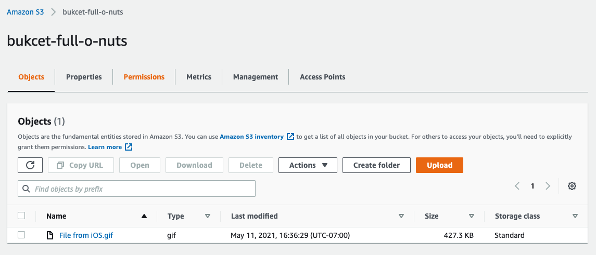
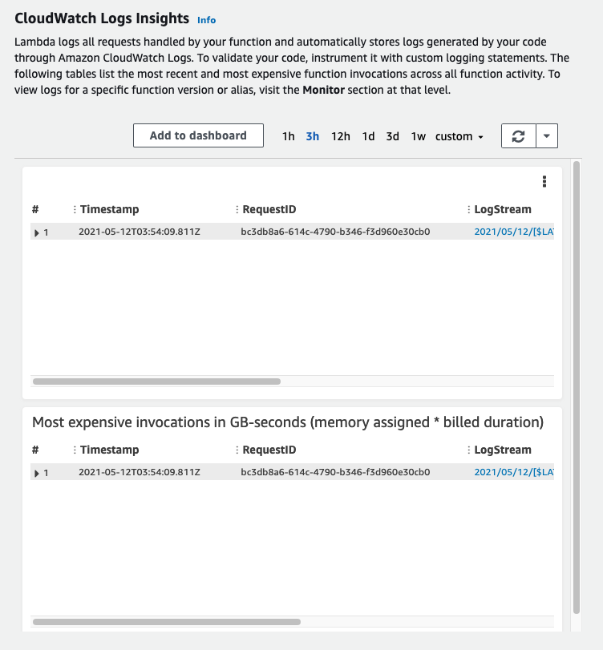
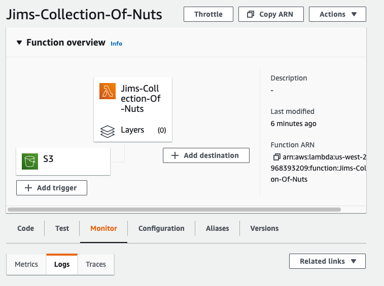

# AWS-S3-and-Lambda

## Tutorial

- **How to use Lambda**

1. Navigate to the Lambda page

2. Click on the **Create Function** button in the right hand corner of the screen

3. Give your function a name

4. For runtime we generally use the default which is Node.js 14.x

5. Leave all the permissions as is, there will be no changes to these.

6. Keep the advanced settings as the same

7. Create the function

- **How to interact with Lambda**

1. Now that you have the function set up, you want to upload your code to Lambda

2. To upload your code you have to zip all the relevant files that would be sent up to Lambda

3. Go back to Lambda and click on upload from

4. Upload the file and it will now be a part of your Lambda

5. Now we want to set up the testing feature within Lambda

- **Testing the uploaded function**

1. Click on test so you can configure the test event

2. Stick with the default template

3. Give your test event a name

4. Put in the test values you wish to run

5. Click on *Create* to create your test

- **Link to S3 for the events**

1. Create your file that will be uploaded to S3

2. Zip the file as so you can send it up to S3

3. Navigate to S3

4. From there you will upload your zipped file that will handle the events.

5. Now we add in the trigger for the function

6. For the trigger we want to use S3 for the bucket

### Image Links

### Terms

- SRP: Single Responsibility Principle

### The Why

- I really tried at this lab but it was like grasping at straws. I get the concept of clicking through and adding the events to the function. I just can't piece together the code at the moment. 